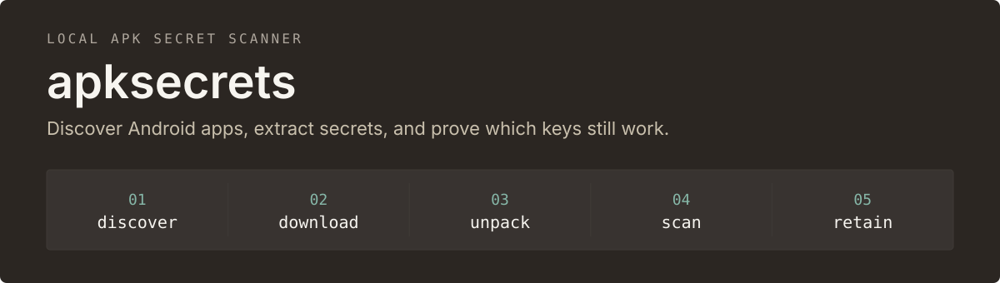
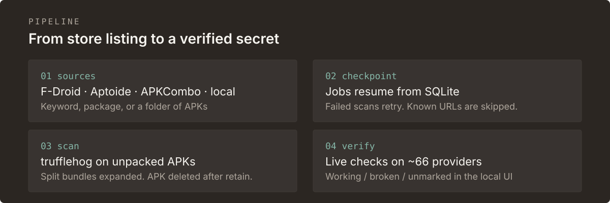

<p align="center">
  
</p>

Checkpointed, local-only secret scanner for APK and split APK archives. It discovers apps from F-Droid, Aptoide, and APKCombo (or imports files you already have), unpacks them, scans with [trufflehog](https://github.com/trufflesecurity/trufflehog), and keeps every finding in a local SQLite database for triage.

## Install

Requires Python 3, [`rich`](https://github.com/Textualize/rich), and a [trufflehog](https://github.com/trufflesecurity/trufflehog) binary on `PATH`.

```sh
pip install -r requirements.txt
brew install trufflehog        # or download from trufflehog releases
```

## First run

```sh
# local web UI — start/stop scans, browse findings, mark working/broken
./apksecrets serve --port 8000
```

Open `http://127.0.0.1:8000`. The server binds to localhost by default.

```sh
# continuous keyword scan across all stores
./apksecrets run --keyword whatsapp --keyword signal --forever

# one package
./apksecrets run --package org.thoughtcrime.securesms

# APKs already on disk
./apksecrets import /path/to/apks
```

<p align="center">
  
</p>

Interrupted scans resume. Failed jobs retry and can be re-queued. After secrets and the scan report are in SQLite, the APK is deleted so disk use stays small and nothing is downloaded twice.

## Commands

| command | purpose |
| --- | --- |
| `run` | discovery + scanning loop (`--forever`, `--interval`, `--workers`, `--keyword`, `--package`, `--random`) |
| `serve` | web UI on `http://127.0.0.1:8000` |
| `import` | queue a local `.apk` / `.apkm` / `.apks` file or folder |
| `apps` / `secrets` / `status` / `failures` | inspect state (`--working 1` filters verified secrets) |
| `mark <id> <working\|broken>` | verdict on a secret |
| `retry-failed` | re-queue failed jobs |

## Sources

| source | notes |
| --- | --- |
| `fdroid` | full index; keywords match package id or app name |
| `aptoide` | search API; every matching app is queued |
| `apkcombo` | search scrape; latest release of each match |
| `local` | `import` subcommand or `--import` |

Forever mode only queues releases that are not already in the database, so each cycle discovers new apps instead of rescanning old ones.

## Web UI

Overview, secrets, apps, and a dedicated verify log. Secrets can be filtered, searched (`/` focuses the field), sorted, copied, and exported as CSV or JSON. Detector names link to the service they belong to.

The auto-verifier probes ~66 secret types against provider APIs and marks them working or broken. Duplicate values are probed once per pass. Keys that cannot be judged alone — OneSignal app ids, a Twilio token without its account SID, a Razorpay key id, Twitter consumer keys — are named as such and left unchecked. **Verify all** re-probes every unmarked secret.

Covered families include Slack, Telegram, Discord, GitHub, GitLab, Google API keys and OAuth tokens, AWS, Stripe, OpenAI, Anthropic, Groq, Mistral, DeepSeek, Hugging Face, Heroku, Dropbox, Mailgun, Mailchimp, Postmark, Figma, Asana, PagerDuty, Linear, New Relic, Spotify, Calendly, Datadog, Notion, Postman, Sentry, Square, Cloudflare, OneSignal, Honeycomb, Facebook, Twitter, Twilio, Brevo, MessageBird, Razorpay, and Slack/Discord webhooks. Unknown detector names fall back to value-shape matching (`sk-`, `ghp_`, `AKIA`, `EAA`, `xkeysib-`, …).

Shared Google `AIza` keys are cross-checked against Firebase/Maps before being marked broken: an Android-restricted or Gemini-disabled key can still prove it belongs to a live project.

## Safety

- Downloads are verified as ZIP/APK before replace. Unpack rejects archive bombs and path traversal.
- Web UI and database listen on `127.0.0.1` by default.
- The state directory is `0700`; scan reports are `0600`.
- Auto-verify contacts live provider APIs with the secrets it found. Use it on a machine you control.

`gemini_key_tester.py` is a standalone helper for Google Gemini keys found during a scan.

## Development

```sh
python3 -m unittest test_apksecrets test_gemini_key_tester -v
```
